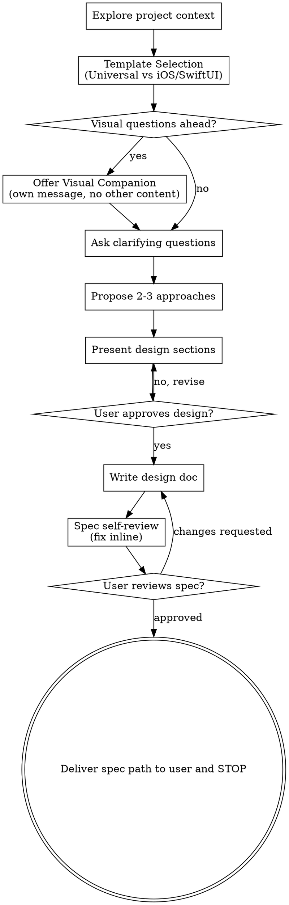

# Brainstorming Ideas Into Designs

Help turn ideas into fully formed designs and specs through natural collaborative dialogue.

Start by understanding the current project context, then ask questions one at a time to refine the idea. Once you understand what you're building, present the design and get user approval.

<HARD-GATE>
Do NOT invoke any implementation skill, write any code, scaffold any project, or take any implementation action until you have presented a design and the user has approved it. This applies to EVERY project regardless of perceived simplicity.
</HARD-GATE>

## Anti-Pattern: "This Is Too Simple To Need A Design"

Every project goes through this process. A todo list, a single-function utility, a config change — all of them. "Simple" projects are where unexamined assumptions cause the most wasted work. The design can be short (a few sentences for truly simple projects), but you MUST present it and get approval.

## Checklist

You MUST create a task for each of these items and complete them in order:

1. **Explore project context** — check files, docs, recent commits
2. **Template Selection** — Ask the user which spec template to use: Universal (通用设计模板) or iOS/SwiftUI (iOS/SwiftUI 专项设计模板).
3. **Offer visual companion** (if topic will involve visual questions) — this is its own message, not combined with a clarifying question. See the Visual Companion section below.
4. **Ask clarifying questions** — one at a time, understand purpose/constraints/success criteria (tailored to the chosen template)
5. **Propose 2-3 approaches** — with trade-offs and your recommendation (highlighting Swift/SwiftUI considerations if applicable)
6. **Present design** — in sections scaled to their complexity (following the chosen template structure), get user approval after each section
7. **Write design doc** — save to `docs/precoding/YYYY-MM-DD-<topic>-design.md` and commit
8. **Spec self-review** — quick inline check for placeholders, contradictions, ambiguity, scope, and template compliance (see below)
9. **User reviews written spec** — ask user to review the spec file before proceeding
10. **Deliver spec to user and STOP** — report the spec file path; do not invoke any other skill or start implementation

## Process Flow

**The terminal state is delivering the spec to the user. STOP.** Do NOT invoke any other skill, do NOT start implementation planning, do NOT write code. Report the spec path and end your turn — the user will decide what to do with the spec.

## The Process

**Understanding the idea:**

- Check out the current project state first (files, docs, recent commits)
- Before asking detailed questions, assess scope: if the request describes multiple independent subsystems (e.g., "build a platform with chat, file storage, billing, and analytics"), flag this immediately. Don't spend questions refining details of a project that needs to be decomposed first.
- If the project is too large for a single spec, help the user decompose into sub-projects: what are the independent pieces, how do they relate, what order should they be built? Then brainstorm the first sub-project through the normal design flow. Each sub-project gets its own spec → plan → implementation cycle.

**Template Selection:**

- You MUST ask the user at the start of the brainstorming: **"Which design template would you like to use for the spec?"**
  - **Option 1: Universal Design Template (通用设计模板)** — For general backend, frontend, CLI, or multi-platform projects.
  - **Option 2: iOS / SwiftUI Design Template (iOS/SwiftUI 专项设计模板)** — For Apple ecosystem apps, focusing on Swift concurrency, SwiftUI state, and HIG guidelines.
- Save the user's choice and tailor all subsequent clarifying questions, approaches, and the final design spec structure to that template.

**Design Spec Templates Structure:**

### Universal Design Template
If selected, the final design spec document must follow this structure:
1. **Overview & Goal**: High-level problem description and user requirements.
2. **Architecture & Components**: Component boundaries, dependencies, and file layout.
3. **Data Flow & State Management**: How data moves between systems/components, database schemas or memory states.
4. **Error Handling & Edge Cases**: Fail-safes, network issues, validation errors.
5. **Testing & Verification**: Unit test strategy, integration verification.

### iOS / SwiftUI Design Template
If selected, the final design spec document must follow this structure:
1. **Deployment Target & SDKs**: Minimum iOS/macOS deployment target (e.g., iOS 17+), local data persistence engine configuration (SwiftData schema design & migrations, or CoreData container structures), and iCloud sync (CloudKit synchronization, conflict resolution).
2. **Architecture & Design Patterns**: Architectural pattern (MVVM, TCA, clean architecture), ViewModel design, and use of modern Swift features (e.g., `@Observable` macros).
3. **SwiftUI State Management**: Detail view state, bindings, environments, and container dependency injection (`@State`, `@Binding`, `@Environment`, etc.).
4. **Swift Concurrency & Swift 6 Safety**: Actor definitions (global actors like `@MainActor`, custom actors), safe data isolation, `@Sendable` closures, preventing strict concurrency compiler warnings/errors, and background thread dispatching.
5. **App Intents & Siri Integration**: Standard actions and shortcuts exposing app functionality to Siri, Spotlight, and Shortcuts via `AppIntent`, `AppEntity`, `EntityQuery`, and assistant schemas.
6. **App Extensions & System Integration**: Design specs for Home/Lock Screen widgets, Live Activities (Dynamic Island layouts), Apple Watch extensions, shared container storage (App Groups, Shared UserDefaults), and push notifications payload handling.
7. **UI/UX & HIG Compliance**: Apple's Human Interface Guidelines (HIG) styling, Dark Mode support, Dynamic Type scale adaptivity, VoiceOver/accessibility descriptions, SF Symbols usage, String Catalogs for localization, and Right-to-Left (RTL) layout support.
8. **Memory Safety & Testing**: Prevention of memory leaks (strong reference cycles, `[weak self]` usage), Unit testing with `XCTest` (async test expectations, actor isolation testing), and UI testing strategies.

**Asking clarifying questions:**

- Ask questions one at a time to refine the idea.
- If the iOS / SwiftUI template is chosen, focus on Swift/SwiftUI specific constraints (e.g., minimum iOS version target, local data persistence engine like SwiftData or CoreData, concurrency constraints).
- Prefer multiple choice questions when possible, but open-ended is fine too.
- Only one question per message - if a topic needs more exploration, break it into multiple questions.
- Focus on understanding: purpose, constraints, success criteria.

**Exploring approaches:**

- Propose 2-3 different approaches with trade-offs.
- Present options conversationally with your recommendation and reasoning.
- Lead with your recommended option and explain why.

**Presenting the design:**

- Once you believe you understand what you're building, present the design.
- Scale each section to its complexity: a few sentences if straightforward, up to 200-300 words if nuanced.
- Ask after each section whether it looks right so far.
- Follow the structure defined by the selected template (Universal or iOS/SwiftUI).
- Be ready to go back and clarify if something doesn't make sense.

**Design for isolation and clarity:**

- Break the system into smaller units that each have one clear purpose, communicate through well-defined interfaces, and can be understood and tested independently.
- For each unit, you should be able to answer: what does it do, how do you use it, and what does it depend on?
- Can someone understand what a unit does without reading its internals? Can you change the internals without breaking consumers? If not, the boundaries need work.
- Smaller, well-bounded units are also easier for you to work with - you reason better about code you can hold in context at once, and your edits are more reliable when files are focused. When a file grows large, that's often a signal that it's doing too much.

**Working in existing codebases:**

- Explore the current structure before proposing changes. Follow existing patterns.
- Where existing code has problems that affect the work (e.g., a file that's grown too large, unclear boundaries, tangled responsibilities), include targeted improvements as part of the design - the way a good developer improves code they're working in.
- Don't propose unrelated refactoring. Stay focused on what serves the current goal.

## After the Design

**Documentation:**

- Write the validated design (spec) to `docs/precoding/YYYY-MM-DD-<topic>-design.md`
  - (User preferences for spec location override this default)
- Commit the design document to git

**Spec Self-Review:**
After writing the spec document, look at it with fresh eyes:

1. **Placeholder scan:** Any "TBD", "TODO", incomplete sections, or vague requirements? Fix them.
2. **Internal consistency:** Do any sections contradict each other? Does the architecture match the feature descriptions?
3. **Scope check:** Is this focused enough for a single implementation plan, or does it need decomposition?
4. **Ambiguity check:** Could any requirement be interpreted two different ways? If so, pick one and make it explicit.
5. **Template Check:** Does the spec match the chosen template? If the iOS/SwiftUI template was chosen, does it explicitly define state management, Swift 6 Concurrency, deployment version target, App Intents/extensions (if applicable), localization/accessibility, and memory safety rules?

Fix any issues inline. No need to re-review — just fix and move on.

**User Review Gate:**
After the spec review loop passes, ask the user to review the written spec before proceeding:

> "Spec written and committed to `<path>`. Please review it and let me know if you want to make any changes before we start writing out the implementation plan."

Wait for the user's response. If they request changes, make them and re-run the spec review loop. Only proceed once the user approves.

**Done — STOP here:**

- Report the spec file path to the user and end your turn.
- Do NOT invoke any other skill.
- Do NOT start implementation planning or write any code.
- The user will decide what to do with the spec on their own.

## Key Principles

- **One question at a time** - Don't overwhelm with multiple questions
- **Multiple choice preferred** - Easier to answer than open-ended when possible
- **YAGNI ruthlessly** - Remove unnecessary features from all designs
- **Explore alternatives** - Always propose 2-3 approaches before settling
- **Incremental validation** - Present design, get approval before moving on
- **Be flexible** - Go back and clarify when something doesn't make sense

## Visual Companion

A browser-based companion for showing mockups, diagrams, and visual options during brainstorming. Available as a tool — not a mode. Accepting the companion means it's available for questions that benefit from visual treatment; it does NOT mean every question goes through the browser.

**Offering the companion:** When you anticipate that upcoming questions will involve visual content (mockups, layouts, diagrams), offer it once for consent:
> "Some of what we're working on might be easier to explain if I can show it to you in a web browser. I can put together mockups, diagrams, comparisons, and other visuals as we go. This feature is still new and can be token-intensive. Want to try it? (Requires opening a local URL)"

**This offer MUST be its own message.** Do not combine it with clarifying questions, context summaries, or any other content. The message should contain ONLY the offer above and nothing else. Wait for the user's response before continuing. If they decline, proceed with text-only brainstorming.

**Per-question decision:** Even after the user accepts, decide FOR EACH QUESTION whether to use the browser or the terminal. The test: **would the user understand this better by seeing it than reading it?**

- **Use the browser** for content that IS visual — mockups, wireframes, layout comparisons, architecture diagrams, side-by-side visual designs
- **Use the terminal** for content that is text — requirements questions, conceptual choices, tradeoff lists, A/B/C/D text options, scope decisions

A question about a UI topic is not automatically a visual question. "What does personality mean in this context?" is a conceptual question — use the terminal. "Which wizard layout works better?" is a visual question — use the browser.

If they agree to the companion, read the detailed guide before proceeding:
`skills/precoding/visual-companion.md`
